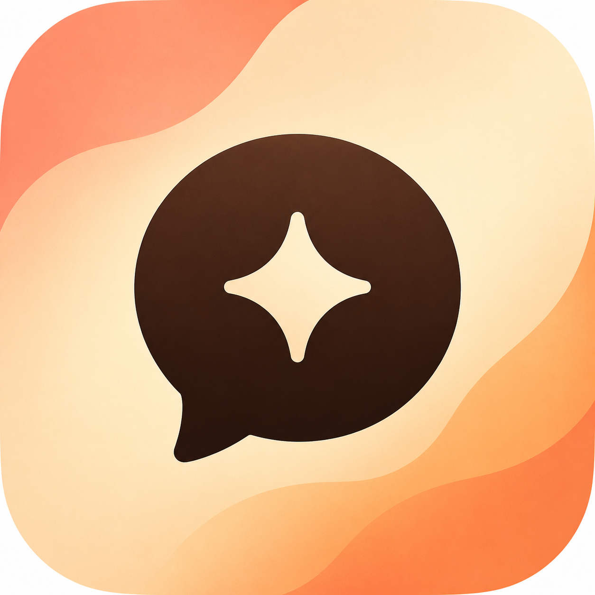
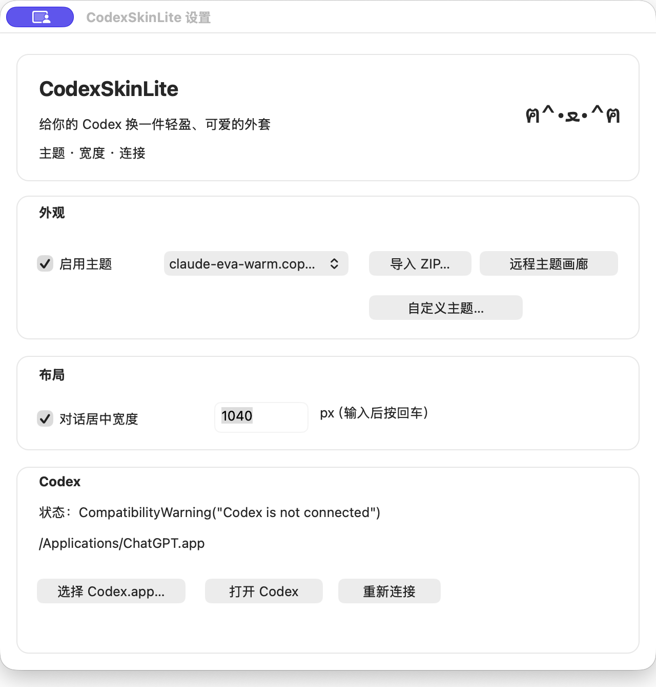
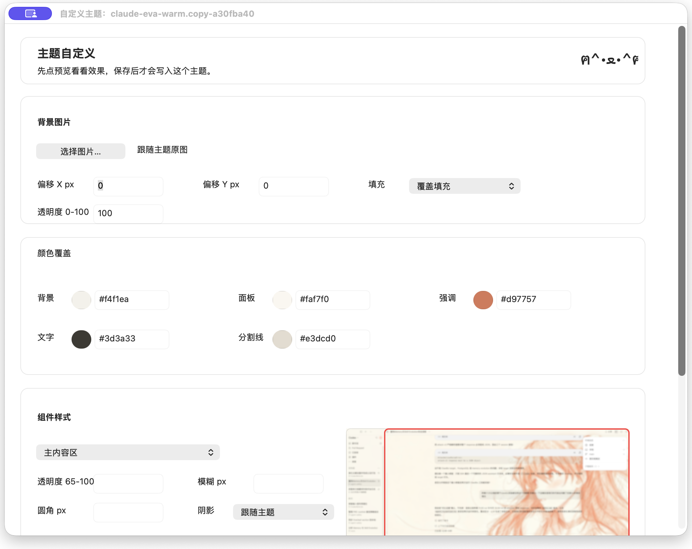
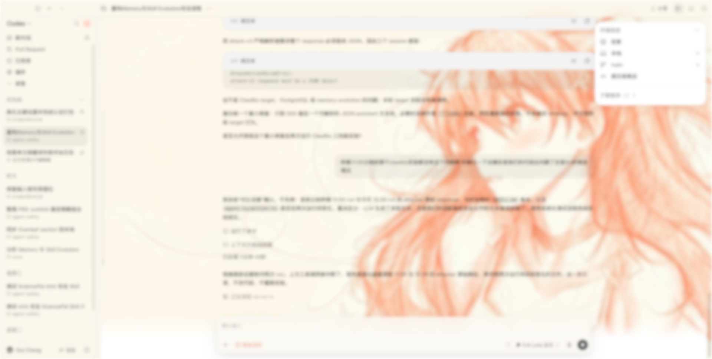

# CodexSkinLite

<p align="center">
  
</p>

<h3 align="center">Make Codex feel like yours.</h3>

<p align="center">
  A small macOS companion for giving the Codex desktop app a warmer, more personal look.
</p>

<p align="center">
  
  
  <a href="LICENSE"></a>
</p>

## Take a look

<table>
  <tr>
    <td align="center" width="50%">
      
    </td>
    <td align="center" width="50%">
      
    </td>
  </tr>
  <tr>
    <td align="center"><sub>Main settings</sub></td>
    <td align="center"><sub>Custom theme editor</sub></td>
  </tr>
</table>

The custom theme editor uses a real Codex layout and moves a red marker to show which part of Codex a setting controls. The preview image is blurred only to keep private conversation text out of the repository.

## Why CodexSkinLite?

Codex is a great place to work, but it does not have to look the same for everyone. CodexSkinLite adds a gentle customization layer for people who want a calmer workspace, a favorite color palette, or a little more personality around their chats.

It works alongside the official Codex app and does not modify the official `Codex.app` bundle.

## What you can do

- **Bring your own theme** — Import DreamSkin-compatible theme ZIPs or browse the theme gallery.
- **Tune the details** — Adjust colors, transparency, blur, corner radius, shadows, and the composer position.
- **See what you are changing** — The custom theme editor shows the real Codex layout and moves a red marker to the selected component.
- **Add a softer background** — Use a background image with position, fill mode, and opacity controls.
- **Choose a more comfortable width** — Keep conversations and the composer centered with a bounded maximum width.
- **Keep settings per theme** — Your custom adjustments stay with the theme you edited.

## In-app preview

<p align="center">
  
</p>

<p align="center"><sub>The editor's Codex preview preserves the real interface structure while blurring private conversation text.</sub></p>

## Download

Download the latest signed and Apple-notarized Apple Silicon build from [Releases](https://github.com/szguicheng/CodexSkinLite/releases/latest).

## Install

1. Download the latest `CodexSkinLite-<version>-macos-arm64.zip` from Releases.
2. Unzip it and move `CodexSkinLite.app` to your Applications folder.
3. Open CodexSkinLite.
4. Use **Open Codex** in CodexSkinLite when you want Codex to start with your saved appearance settings.

CodexSkinLite currently supports Apple Silicon Macs (`M1` and later) with the Codex desktop app installed.

## Make your first look

1. Open the CodexSkinLite settings window.
2. Import a theme ZIP, or open the [DreamSkin theme gallery](https://dreamskin.cc/gallery).
3. Select a theme and enable it.
4. Open **Custom Theme** to choose colors, a background image, and component styles.
5. Select a component to see exactly which part of the Codex interface it controls.
6. Use **Preview** to try the changes, then **Save** when the look feels right.

Your theme package stays unchanged. CodexSkinLite stores your personal adjustments separately, so you can return to the original theme at any time.

## A few useful notes

- If Codex was already open, launch it through **Open Codex** so CodexSkinLite can connect cleanly.
- An existing Codex session is not terminated automatically just because it was started without CodexSkinLite.
- Imported themes and customizations are kept locally in your macOS Application Support folder.
- If a theme ever needs a clean start, choose **None** or reset its customization from the settings window.

## For contributors

<details>
<summary>Build and test locally</summary>

```bash
cargo test --all-targets
npm ci --prefix renderer
npm test --prefix renderer
```

The packaged app is built for Apple Silicon. Release packaging requires a Developer ID Application certificate and an Apple notarytool keychain profile.

</details>

## License and attribution

CodexSkinLite is licensed under the [GNU Affero General Public License v3.0 only](LICENSE).

The project contains adapted compatibility concepts and code from [CodexPlusPlus](https://github.com/BigPizzaV3/CodexPlusPlus). See [NOTICE](NOTICE) for attribution and additional context.

Codex is a product of OpenAI. CodexSkinLite is an independent utility and is not affiliated with or endorsed by OpenAI.
